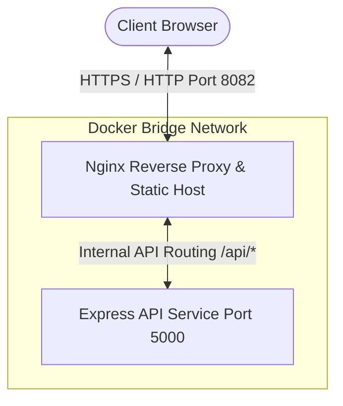

# Premium Fullstack Hello World (Dockerized)

A high-fidelity fullstack application demonstrating a beautiful **glassmorphic frontend** served by **Nginx**, connected to a lightweight **Python FastAPI backend**, fully containerized using **Docker** and orchestrated with **Docker Compose**.

---

## Enterprise Architecture Overview

This project employs a robust, production-grade microservices architecture composed of a high-performance presentation tier (React SPA hosted on Nginx) and a micro-service API tier (Python FastAPI), fully orchestrated via a secure Docker bridge network.



### System Components

1. **Frontend Presentation Layer (React SPA / Nginx)**:
   - Built as a React Single-Page Application (SPA) compiled to production-optimized static assets.
   - Served by Nginx (Alpine-based) acting as both the static content host and the front-facing API Gateway.
   - Provides a state-of-the-art Glassmorphic user interface, offering real-time health telemetry, network latency estimation, and automated connection pooling indicators.

2. **Backend API Service Layer (Python / FastAPI)**:
   - High-performance, lightweight micro-API designed with Python FastAPI and Uvicorn.
   - Exposes RESTful endpoints (`/api/hello` for core payloads, `/api/health` for automated infrastructure health checks).
   - Fully optimized under production environments with sub-millisecond response latency and automatic container-level failure recovery.

3. **Unified API Gateway Proxying (Nginx Reverse Proxy)**:
   - Configured via custom Nginx upstream forwarding rules to route `/api/*` requests directly to backend microservices inside the private bridge network.
   - Bypasses Cross-Origin Resource Sharing (CORS) security blocks by exposing a single unified origin to the client browser, mitigating common CORS handshake latency and security vectors.

---

## Folder Structure

```
├── backend/
│   ├── Dockerfile         # Optimized multi-stage build for Python FastAPI app
│   ├── requirements.txt   # Python dependencies (FastAPI, Uvicorn)
│   └── main.py            # FastAPI app entrypoint (API routes)
├── frontend/
│   ├── Dockerfile         # Nginx container definition
│   ├── nginx.conf         # Static server & API proxy rules
│   ├── index.html         # Premium web UI layout
│   ├── styles.css         # Custom animations, glassmorphism, & dark mode theme
│   └── app.js             # Client-side API integration & UI state management
├── docker-compose.yml     # Service orchestrator (builds & binds ports)
└── README.md              # Documentation (This file)
```

---

## Quickstart

### Prerequisites
Make sure you have [Docker](https://docs.docker.com/get-docker/) and [Docker Compose](https://docs.docker.com/compose/install/) installed.

### Run Application
From the root directory of this project, execute:

```bash
docker compose up --build
```

This command builds the images, sets up the shared network, launches the containers, and monitors health statuses.

* **Frontend Dashboard**: Access at [http://localhost:8082](http://localhost:8082)
* **Backend API directly**: Access at [http://localhost:5000/api/hello](http://localhost:5000/api/hello)

### Shutting Down
To stop the services and clean up the container network:

```bash
docker compose down
```

---

## Comprehensive Testing Guide

Follow this guide to verify the containers, inspect endpoint connections, validate proxy routing, and test site resilience.

### Step 1: Verify Containers are Active
Confirm that both containers are built and running correctly within the bridge network:
```bash
docker compose ps
```
*Expected Output: Both `hello-world-backend` and `hello-world-frontend` containers should show a status of `running` and `healthy`.*

### Step 2: Test the Frontend Website (GUI Verification)
Open your web browser and go to [http://localhost:8082](http://localhost:8082).
* **Live Connection Indicator (Top)**: Glows neon green (`Backend Online`). This verifies Nginx and FastAPI are successfully exchanging data.
* **Hello Message (Center)**: Displays the response string retrieved from Python FastAPI.
* **Interactive Refresh**: Click **`Refresh Data`** to trigger the custom SVG spinner, pull new backend telemetry, and calculate current latency.
* **Developer Payload Inspector**: Toggle the details accordion at the bottom to view the target URL, raw HTTP status code, request latency in milliseconds, and the actual prettified JSON payload.

### Step 3: Test API Endpoints Directly (CLI Verification)
Perform health and connectivity checks directly from your command line:

1. **Test the Nginx Reverse Proxy (Frontend Container)**:
   ```bash
   curl -i http://localhost:8082/api/hello
   ```
   *Expects a `200 OK` response returning the hello message JSON payload.*

2. **Test Nginx Internal Health Route**:
   ```bash
   curl -i http://localhost:8082/api/health
   ```
   *Expects a `200 OK` response with `{"status":"UP", "uptime":...}`.*

3. **Test the FastAPI Server Directly**:
   ```bash
   curl -i http://localhost:5000/api/hello
   ```
   *Expects a `200 OK` response directly from python on port 5000.*

### Step 4: Test Internal Connection Routing (Docker DNS)
Verify that Nginx can communicate with the backend internally using Docker's bridge networking:
```bash
docker compose exec frontend wget -qO- http://backend:5000/api/health
```
*Expected Output: Returns the backend health check payload, validating internal DNS name resolution.*

### Step 5: Test Connection Loss Resilience (Offline Failover)
Test the application's recovery behavior in case of a service outage:
1. In your terminal, stop the backend API container:
   ```bash
   docker compose stop backend
   ```
2. Observe your browser tab:
   - The indicator will instantly pulse neon red (`Grid Offline`).
   - The main display will show a friendly connection warning.
   - The inspector prints the detailed network failure payload.
3. Restart the backend container:
   ```bash
   docker compose start backend
   ```
4. Observe the frontend automatically recover, reconnect to the API, and display the live payload.

